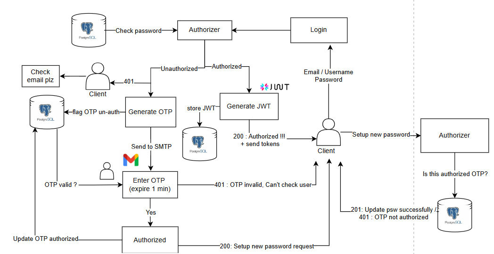

# GRAND-BACKEND

This repository contains the core of the TIMENEST application. It is part of a microservices architecutre, with other repositories working together to form the complete system.

Other repo:

FRONTEND: https://github.com/ML-K67-HUST/GRAND-FRONTEND

AGENT: https://github.com/ML-K67-HUST/TIME-MANAGEMENT-AGENT

VECTOR STORE: https://github.com/ML-K67-HUST/TIMENEST-VECTOR-STORE

DATA GENERATION: https://github.com/ML-K67-HUST/TIMENEST-DATALAB

MESSAGE BROKER: https://github.com/ML-K67-HUST/TIMENEST-MESSAGE-BROKER

## Basic architecutre

### Authorization workflow




## Development Setup

1. Clone the repository
2. Create a virtual environment and activate it
3. Install dependencies:
```bash
pip install -r requirements.txt
```

4. Set up environment variables:
   - Copy `.env.example` to `.env`
   - Fill in your environment variables

5. Run the application:
```bash
bash run.sh
```

For scaled deployment:
```bash
bash run.sh --scale=True
```

## CI/CD Pipeline

The project uses GitHub Actions for continuous integration and deployment:

### Continuous Integration (CI)
- Runs on every push to main and pull requests
- Sets up a PostgreSQL service container
- Installs Python dependencies
- Runs tests with pytest
- Uses GitHub Secrets for sensitive environment variables

### Continuous Deployment (CD)
- Runs on every push to main branch
- Automatically deploys to fly.io
- Sets up all required secrets
- Deploys the application using flyctl

### Required GitHub Secrets
The following secrets need to be set in your GitHub repository settings:
- `TOGETHER_AI_API_KEY`
- `MONGDB_URL`
- `MAILGUN_API_KEY`
- `GOOGLE_CLIENT_ID`
- `GOOGLE_CLIENT_SECRET`
- `SECRET_KEY`
- `JWT_SECRET_KEY`
- `JWT_REFRESH_SECRET_KEY`
- `REDIS_URL`
- `REDIS_PORT`
- `REDIS_PASSWORD`
- `FLYCTL_ACCESS_TOKEN`
- `AWS_POSTGRES_URL`
- `POSTGRES_USER`
- `POSTGRES_PASSWORD`
- `POSTGRES_DB`
- `POSTGRES_PORT`
- `MONGDB_TIMENEST_DN_NAME`
- `REDIRECT_URL`
- `FRONTEND_URL`

## Manual Deployment

For manual deployment to fly.io:
```bash
bash deploy.sh
```

access endpoint `localhost:5050/docs` to start use/test this backend api

then access `localhost:80/docs`
